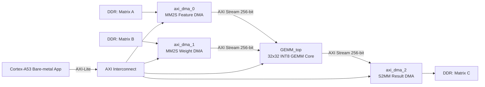

 HEAD
# llama.cpp


[](https://opensource.org/licenses/MIT)
[](https://github.com/ggml-org/llama.cpp/releases)
[](https://github.com/ggml-org/llama.cpp/actions/workflows/server.yml)
[](https://github.com/ggml-org/llama.cpp/actions/workflows/docker.yml)
[](https://github.com/ggml-org/llama.cpp/actions/workflows/winget.yml)

[Manifesto](https://github.com/ggml-org/llama.cpp/discussions/205) / [ggml](https://github.com/ggml-org/ggml) / [ops](https://github.com/ggml-org/llama.cpp/blob/master/docs/ops.md)

LLM inference in C/C++

## Recent API changes

- [Changelog for `libllama` API](https://github.com/ggml-org/llama.cpp/issues/9289)
- [Changelog for `llama-server` REST API](https://github.com/ggml-org/llama.cpp/issues/9291)

## Hot topics

- **Hugging Face cache migration: models downloaded with `-hf` are now stored in the standard Hugging Face cache directory, enabling sharing with other HF tools.**
- **[guide : using the new WebUI of llama.cpp](https://github.com/ggml-org/llama.cpp/discussions/16938)**
- [guide : running gpt-oss with llama.cpp](https://github.com/ggml-org/llama.cpp/discussions/15396)
- [[FEEDBACK] Better packaging for llama.cpp to support downstream consumers 🤗](https://github.com/ggml-org/llama.cpp/discussions/15313)
- Support for the `gpt-oss` model with native MXFP4 format has been added | [PR](https://github.com/ggml-org/llama.cpp/pull/15091) | [Collaboration with NVIDIA](https://blogs.nvidia.com/blog/rtx-ai-garage-openai-oss) | [Comment](https://github.com/ggml-org/llama.cpp/discussions/15095)
- Multimodal support arrived in `llama-server`: [#12898](https://github.com/ggml-org/llama.cpp/pull/12898) | [documentation](./docs/multimodal.md)
- VS Code extension for FIM completions: https://github.com/ggml-org/llama.vscode
- Vim/Neovim plugin for FIM completions: https://github.com/ggml-org/llama.vim
- Hugging Face Inference Endpoints now support GGUF out of the box! https://github.com/ggml-org/llama.cpp/discussions/9669
- Hugging Face GGUF editor: [discussion](https://github.com/ggml-org/llama.cpp/discussions/9268) | [tool](https://huggingface.co/spaces/CISCai/gguf-editor)
- WebGPU support is now available in the browser, see a blog/demo introducing it [here](https://reeselevine.github.io/llamas-on-the-web/).

----

## Quick start

Getting started with llama.cpp is straightforward. Here are several ways to install it on your machine:

- Install `llama.cpp` using [brew, nix, winget, or conda-forge](docs/install.md)
- Run with Docker - see our [Docker documentation](docs/docker.md)
- Download pre-built binaries from the [releases page](https://github.com/ggml-org/llama.cpp/releases)
- Build from source by cloning this repository - check out [our build guide](docs/build.md)

Once installed, you'll need a model to work with. Head to the [Obtaining and quantizing models](#obtaining-and-quantizing-models) section to learn more.

Example command:

```sh
# Use a local model file
llama-cli -m my_model.gguf

# Or download and run a model directly from Hugging Face
llama-cli -hf ggml-org/gemma-3-1b-it-GGUF

# Launch OpenAI-compatible API server
llama-server -hf ggml-org/gemma-3-1b-it-GGUF
```

## Description

The main goal of `llama.cpp` is to enable LLM inference with minimal setup and state-of-the-art performance on a wide
range of hardware - locally and in the cloud.

- Plain C/C++ implementation without any dependencies
- Apple silicon is a first-class citizen - optimized via ARM NEON, Accelerate and Metal frameworks
- AVX, AVX2, AVX512 and AMX support for x86 architectures
- RVV, ZVFH, ZFH, ZICBOP and ZIHINTPAUSE support for RISC-V architectures
- 1.5-bit, 2-bit, 3-bit, 4-bit, 5-bit, 6-bit, and 8-bit integer quantization for faster inference and reduced memory use
- Custom CUDA kernels for running LLMs on NVIDIA GPUs (support for AMD GPUs via HIP and Moore Threads GPUs via MUSA)
- Vulkan and SYCL backend support
- CPU+GPU hybrid inference to partially accelerate models larger than the total VRAM capacity

The `llama.cpp` project is the main playground for developing new features for the [ggml](https://github.com/ggml-org/ggml) library.

<details>
<summary>Models</summary>

Typically finetunes of the base models below are supported as well.

Instructions for adding support for new models: [HOWTO-add-model.md](docs/development/HOWTO-add-model.md)

#### Text-only

- [X] LLaMA 🦙
- [x] LLaMA 2 🦙🦙
- [x] LLaMA 3 🦙🦙🦙
- [X] [Mistral 7B](https://huggingface.co/mistralai/Mistral-7B-v0.1)
- [x] [Mixtral MoE](https://huggingface.co/models?search=mistral-ai/Mixtral)
- [x] [DBRX](https://huggingface.co/databricks/dbrx-instruct)
- [x] [Jamba](https://huggingface.co/ai21labs)
- [X] [Falcon](https://huggingface.co/models?search=tiiuae/falcon)
- [X] [Chinese LLaMA / Alpaca](https://github.com/ymcui/Chinese-LLaMA-Alpaca) and [Chinese LLaMA-2 / Alpaca-2](https://github.com/ymcui/Chinese-LLaMA-Alpaca-2)
- [X] [Vigogne (French)](https://github.com/bofenghuang/vigogne)
- [X] [BERT](https://github.com/ggml-org/llama.cpp/pull/5423)
- [X] [Koala](https://bair.berkeley.edu/blog/2023/04/03/koala/)
- [X] [Baichuan 1 & 2](https://huggingface.co/models?search=baichuan-inc/Baichuan) + [derivations](https://huggingface.co/hiyouga/baichuan-7b-sft)
- [X] [Aquila 1 & 2](https://huggingface.co/models?search=BAAI/Aquila)
- [X] [Starcoder models](https://github.com/ggml-org/llama.cpp/pull/3187)
- [X] [Refact](https://huggingface.co/smallcloudai/Refact-1_6B-fim)
- [X] [MPT](https://github.com/ggml-org/llama.cpp/pull/3417)
- [X] [Bloom](https://github.com/ggml-org/llama.cpp/pull/3553)
- [x] [Yi models](https://huggingface.co/models?search=01-ai/Yi)
- [X] [StableLM models](https://huggingface.co/stabilityai)
- [x] [Deepseek models](https://huggingface.co/models?search=deepseek-ai/deepseek)
- [x] [Qwen models](https://huggingface.co/models?search=Qwen/Qwen)
- [x] [PLaMo-13B](https://github.com/ggml-org/llama.cpp/pull/3557)
- [x] [Phi models](https://huggingface.co/models?search=microsoft/phi)
- [x] [PhiMoE](https://github.com/ggml-org/llama.cpp/pull/11003)
- [x] [GPT-2](https://huggingface.co/gpt2)
- [x] [Orion 14B](https://github.com/ggml-org/llama.cpp/pull/5118)
- [x] [InternLM2](https://huggingface.co/models?search=internlm2)
- [x] [CodeShell](https://github.com/WisdomShell/codeshell)
- [x] [Gemma](https://ai.google.dev/gemma)
- [x] [Mamba](https://github.com/state-spaces/mamba)
- [x] [Grok-1](https://huggingface.co/keyfan/grok-1-hf)
- [x] [Xverse](https://huggingface.co/models?search=xverse)
- [x] [Command-R models](https://huggingface.co/models?search=CohereForAI/c4ai-command-r)
- [x] [SEA-LION](https://huggingface.co/models?search=sea-lion)
- [x] [GritLM-7B](https://huggingface.co/GritLM/GritLM-7B) + [GritLM-8x7B](https://huggingface.co/GritLM/GritLM-8x7B)
- [x] [OLMo](https://allenai.org/olmo)
- [x] [OLMo 2](https://allenai.org/olmo)
- [x] [OLMoE](https://huggingface.co/allenai/OLMoE-1B-7B-0924)
- [x] [Granite models](https://huggingface.co/collections/ibm-granite/granite-code-models-6624c5cec322e4c148c8b330)
- [x] [GPT-NeoX](https://github.com/EleutherAI/gpt-neox) + [Pythia](https://github.com/EleutherAI/pythia)
- [x] [Snowflake-Arctic MoE](https://huggingface.co/collections/Snowflake/arctic-66290090abe542894a5ac520)
- [x] [Smaug](https://huggingface.co/models?search=Smaug)
- [x] [Poro 34B](https://huggingface.co/LumiOpen/Poro-34B)
- [x] [Bitnet b1.58 models](https://huggingface.co/1bitLLM)
- [x] [Flan T5](https://huggingface.co/models?search=flan-t5)
- [x] [Open Elm models](https://huggingface.co/collections/apple/openelm-instruct-models-6619ad295d7ae9f868b759ca)
- [x] [ChatGLM3-6b](https://huggingface.co/THUDM/chatglm3-6b) + [ChatGLM4-9b](https://huggingface.co/THUDM/glm-4-9b) + [GLMEdge-1.5b](https://huggingface.co/THUDM/glm-edge-1.5b-chat) + [GLMEdge-4b](https://huggingface.co/THUDM/glm-edge-4b-chat)
- [x] [GLM-4-0414](https://huggingface.co/collections/THUDM/glm-4-0414-67f3cbcb34dd9d252707cb2e)
- [x] [SmolLM](https://huggingface.co/collections/HuggingFaceTB/smollm-6695016cad7167254ce15966)
- [x] [EXAONE-3.0-7.8B-Instruct](https://huggingface.co/LGAI-EXAONE/EXAONE-3.0-7.8B-Instruct)
- [x] [FalconMamba Models](https://huggingface.co/collections/tiiuae/falconmamba-7b-66b9a580324dd1598b0f6d4a)
- [x] [Jais](https://huggingface.co/inceptionai/jais-13b-chat)
- [x] [Bielik-11B-v2.3](https://huggingface.co/collections/speakleash/bielik-11b-v23-66ee813238d9b526a072408a)
- [x] [RWKV-7](https://huggingface.co/collections/shoumenchougou/rwkv7-gxx-gguf)
- [x] [RWKV-6](https://github.com/BlinkDL/RWKV-LM)
- [x] [QRWKV-6](https://huggingface.co/recursal/QRWKV6-32B-Instruct-Preview-v0.1)
- [x] [GigaChat-20B-A3B](https://huggingface.co/ai-sage/GigaChat-20B-A3B-instruct)
- [X] [Trillion-7B-preview](https://huggingface.co/trillionlabs/Trillion-7B-preview)
- [x] [Ling models](https://huggingface.co/collections/inclusionAI/ling-67c51c85b34a7ea0aba94c32)
- [x] [LFM2 models](https://huggingface.co/collections/LiquidAI/lfm2-686d721927015b2ad73eaa38)
- [x] [Hunyuan models](https://huggingface.co/collections/tencent/hunyuan-dense-model-6890632cda26b19119c9c5e7)
- [x] [BailingMoeV2 (Ring/Ling 2.0) models](https://huggingface.co/collections/inclusionAI/ling-v2-68bf1dd2fc34c306c1fa6f86)
- [x] [Mellum models](https://huggingface.co/JetBrains/models?search=mellum)

#### Multimodal

- [x] [LLaVA 1.5 models](https://huggingface.co/collections/liuhaotian/llava-15-653aac15d994e992e2677a7e), [LLaVA 1.6 models](https://huggingface.co/collections/liuhaotian/llava-16-65b9e40155f60fd046a5ccf2)
- [x] [BakLLaVA](https://huggingface.co/models?search=SkunkworksAI/Bakllava)
- [x] [Obsidian](https://huggingface.co/NousResearch/Obsidian-3B-V0.5)
- [x] [ShareGPT4V](https://huggingface.co/models?search=Lin-Chen/ShareGPT4V)
- [x] [MobileVLM 1.7B/3B models](https://huggingface.co/models?search=mobileVLM)
- [x] [Yi-VL](https://huggingface.co/models?search=Yi-VL)
- [x] [Mini CPM](https://huggingface.co/models?search=MiniCPM)
- [x] [Moondream](https://huggingface.co/vikhyatk/moondream2)
- [x] [Bunny](https://github.com/BAAI-DCAI/Bunny)
- [x] [GLM-EDGE](https://huggingface.co/models?search=glm-edge)
- [x] [Qwen2-VL](https://huggingface.co/collections/Qwen/qwen2-vl-66cee7455501d7126940800d)
- [x] [LFM2-VL](https://huggingface.co/collections/LiquidAI/lfm2-vl-68963bbc84a610f7638d5ffa)

</details>

<details>
<summary>Bindings</summary>

- Python: [ddh0/easy-llama](https://github.com/ddh0/easy-llama)
- Python: [abetlen/llama-cpp-python](https://github.com/abetlen/llama-cpp-python)
- Go: [go-skynet/go-llama.cpp](https://github.com/go-skynet/go-llama.cpp)
- Node.js: [withcatai/node-llama-cpp](https://github.com/withcatai/node-llama-cpp)
- JS/TS (llama.cpp server client): [lgrammel/modelfusion](https://modelfusion.dev/integration/model-provider/llamacpp)
- JS/TS (Programmable Prompt Engine CLI): [offline-ai/cli](https://github.com/offline-ai/cli)
- JavaScript/Wasm (works in browser): [tangledgroup/llama-cpp-wasm](https://github.com/tangledgroup/llama-cpp-wasm)
- Typescript/Wasm (nicer API, available on npm): [ngxson/wllama](https://github.com/ngxson/wllama)
- Ruby: [yoshoku/llama_cpp.rb](https://github.com/yoshoku/llama_cpp.rb)
- Ruby: [docusealco/rllama](https://github.com/docusealco/rllama)
- Rust (more features): [edgenai/llama_cpp-rs](https://github.com/edgenai/llama_cpp-rs)
- Rust (nicer API): [mdrokz/rust-llama.cpp](https://github.com/mdrokz/rust-llama.cpp)
- Rust (more direct bindings): [utilityai/llama-cpp-rs](https://github.com/utilityai/llama-cpp-rs)
- Rust (automated build from crates.io): [ShelbyJenkins/llm_client](https://github.com/ShelbyJenkins/llm_client)
- C#/.NET: [SciSharp/LLamaSharp](https://github.com/SciSharp/LLamaSharp)
- C#/VB.NET (more features - community license): [LM-Kit.NET](https://docs.lm-kit.com/lm-kit-net/index.html)
- Scala 3: [donderom/llm4s](https://github.com/donderom/llm4s)
- Clojure: [phronmophobic/llama.clj](https://github.com/phronmophobic/llama.clj)
- React Native: [mybigday/llama.rn](https://github.com/mybigday/llama.rn)
- Java: [kherud/java-llama.cpp](https://github.com/kherud/java-llama.cpp)
- Java: [QuasarByte/llama-cpp-jna](https://github.com/QuasarByte/llama-cpp-jna)
- Zig: [deins/llama.cpp.zig](https://github.com/Deins/llama.cpp.zig)
- Flutter/Dart: [netdur/llama_cpp_dart](https://github.com/netdur/llama_cpp_dart)
- Flutter: [xuegao-tzx/Fllama](https://github.com/xuegao-tzx/Fllama)
- PHP (API bindings and features built on top of llama.cpp): [distantmagic/resonance](https://github.com/distantmagic/resonance) [(more info)](https://github.com/ggml-org/llama.cpp/pull/6326)
- Guile Scheme: [guile_llama_cpp](https://savannah.nongnu.org/projects/guile-llama-cpp)
- Swift [srgtuszy/llama-cpp-swift](https://github.com/srgtuszy/llama-cpp-swift)
- Swift [ShenghaiWang/SwiftLlama](https://github.com/ShenghaiWang/SwiftLlama)
- Delphi [Embarcadero/llama-cpp-delphi](https://github.com/Embarcadero/llama-cpp-delphi)
- Go (no CGo needed): [hybridgroup/yzma](https://github.com/hybridgroup/yzma)
- Android: [llama.android](/examples/llama.android)

</details>

<details>
<summary>UIs</summary>

*(to have a project listed here, it should clearly state that it depends on `llama.cpp`)*

- [AI Sublime Text plugin](https://github.com/yaroslavyaroslav/OpenAI-sublime-text) (MIT)
- [BonzAI App](https://apps.apple.com/us/app/bonzai-your-local-ai-agent/id6752847988) (proprietary)
- [cztomsik/ava](https://github.com/cztomsik/ava) (MIT)
- [Dot](https://github.com/alexpinel/Dot) (GPL)
- [eva](https://github.com/ylsdamxssjxxdd/eva) (MIT)
- [iohub/collama](https://github.com/iohub/coLLaMA) (Apache-2.0)
- [janhq/jan](https://github.com/janhq/jan) (AGPL)
- [johnbean393/Sidekick](https://github.com/johnbean393/Sidekick) (MIT)
- [KanTV](https://github.com/zhouwg/kantv?tab=readme-ov-file) (Apache-2.0)
- [KodiBot](https://github.com/firatkiral/kodibot) (GPL)
- [llama.vim](https://github.com/ggml-org/llama.vim) (MIT)
- [LARS](https://github.com/abgulati/LARS) (AGPL)
- [Llama Assistant](https://github.com/vietanhdev/llama-assistant) (GPL)
- [LlamaLib](https://github.com/undreamai/LlamaLib) (Apache-2.0)
- [LLMFarm](https://github.com/guinmoon/LLMFarm?tab=readme-ov-file) (MIT)
- [LLMUnity](https://github.com/undreamai/LLMUnity) (MIT)
- [LMStudio](https://lmstudio.ai/) (proprietary)
- [LocalAI](https://github.com/mudler/LocalAI) (MIT)
- [LostRuins/koboldcpp](https://github.com/LostRuins/koboldcpp) (AGPL)
- [MindMac](https://mindmac.app) (proprietary)
- [MindWorkAI/AI-Studio](https://github.com/MindWorkAI/AI-Studio) (FSL-1.1-MIT)
- [Mobile-Artificial-Intelligence/maid](https://github.com/Mobile-Artificial-Intelligence/maid) (MIT)
- [Mozilla-Ocho/llamafile](https://github.com/Mozilla-Ocho/llamafile) (Apache-2.0)
- [nat/openplayground](https://github.com/nat/openplayground) (MIT)
- [nomic-ai/gpt4all](https://github.com/nomic-ai/gpt4all) (MIT)
- [ollama/ollama](https://github.com/ollama/ollama) (MIT)
- [oobabooga/text-generation-webui](https://github.com/oobabooga/text-generation-webui) (AGPL)
- [PocketPal AI](https://github.com/a-ghorbani/pocketpal-ai) (MIT)
- [psugihara/FreeChat](https://github.com/psugihara/FreeChat) (MIT)
- [ptsochantaris/emeltal](https://github.com/ptsochantaris/emeltal) (MIT)
- [pythops/tenere](https://github.com/pythops/tenere) (AGPL)
- [ramalama](https://github.com/containers/ramalama) (MIT)
- [semperai/amica](https://github.com/semperai/amica) (MIT)
- [withcatai/catai](https://github.com/withcatai/catai) (MIT)
- [Autopen](https://github.com/blackhole89/autopen) (GPL)

</details>

<details>
<summary>Tools</summary>

- [akx/ggify](https://github.com/akx/ggify) – download PyTorch models from Hugging Face Hub and convert them to GGML
- [akx/ollama-dl](https://github.com/akx/ollama-dl) – download models from the Ollama library to be used directly with llama.cpp
- [crashr/gppm](https://github.com/crashr/gppm) – launch llama.cpp instances utilizing NVIDIA Tesla P40 or P100 GPUs with reduced idle power consumption
- [gpustack/gguf-parser](https://github.com/gpustack/gguf-parser-go/tree/main/cmd/gguf-parser) - review/check the GGUF file and estimate the memory usage
- [Styled Lines](https://marketplace.unity.com/packages/tools/generative-ai/styled-lines-llama-cpp-model-292902) (proprietary licensed, async wrapper of inference part for game development in Unity3d with pre-built Mobile and Web platform wrappers and a model example)
- [unslothai/unsloth](https://github.com/unslothai/unsloth) – 🦥 exports/saves fine-tuned and trained models to GGUF (Apache-2.0)

</details>

<details>
<summary>Infrastructure</summary>

- [Paddler](https://github.com/intentee/paddler) - Open-source LLMOps platform for hosting and scaling AI in your own infrastructure
- [GPUStack](https://github.com/gpustack/gpustack) - Manage GPU clusters for running LLMs
- [llama_cpp_canister](https://github.com/onicai/llama_cpp_canister) - llama.cpp as a smart contract on the Internet Computer, using WebAssembly
- [llama-swap](https://github.com/mostlygeek/llama-swap) - transparent proxy that adds automatic model switching with llama-server
- [Kalavai](https://github.com/kalavai-net/kalavai-client) - Crowdsource end to end LLM deployment at any scale
- [llmaz](https://github.com/InftyAI/llmaz) - ☸️ Easy, advanced inference platform for large language models on Kubernetes.
- [LLMKube](https://github.com/defilantech/llmkube) - Kubernetes operator for llama.cpp with multi-GPU and Apple Silicon Metal
  support"
</details>

<details>
<summary>Games</summary>

- [Lucy's Labyrinth](https://github.com/MorganRO8/Lucys_Labyrinth) - A simple maze game where agents controlled by an AI model will try to trick you.

</details>


## Supported backends

| Backend | Target devices |
| --- | --- |
| [Metal](docs/build.md#metal-build) | Apple Silicon |
| [BLAS](docs/build.md#blas-build) | All |
| [BLIS](docs/backend/BLIS.md) | All |
| [SYCL](docs/backend/SYCL.md) | Intel GPU |
| [OpenVINO [In Progress]](docs/backend/OPENVINO.md) | Intel CPUs, GPUs, and NPUs |
| [MUSA](docs/build.md#musa) | Moore Threads GPU |
| [CUDA](docs/build.md#cuda) | Nvidia GPU |
| [HIP](docs/build.md#hip) | AMD GPU |
| [ZenDNN](docs/build.md#zendnn) | AMD CPU |
| [Vulkan](docs/build.md#vulkan) | GPU |
| [CANN](docs/build.md#cann) | Ascend NPU |
| [OpenCL](docs/backend/OPENCL.md) | Adreno GPU |
| [IBM zDNN](docs/backend/zDNN.md) | IBM Z & LinuxONE |
| [WebGPU](docs/build.md#webgpu) | All |
| [RPC](https://github.com/ggml-org/llama.cpp/tree/master/tools/rpc) | All |
| [Hexagon [In Progress]](docs/backend/snapdragon/README.md) | Snapdragon |
| [VirtGPU](docs/backend/VirtGPU.md) | VirtGPU APIR |

## Obtaining and quantizing models

The [Hugging Face](https://huggingface.co) platform hosts a [number of LLMs](https://huggingface.co/models?library=gguf&sort=trending) compatible with `llama.cpp`:

- [Trending](https://huggingface.co/models?library=gguf&sort=trending)
- [LLaMA](https://huggingface.co/models?sort=trending&search=llama+gguf)

You can either manually download the GGUF file or directly use any `llama.cpp`-compatible models from [Hugging Face](https://huggingface.co/) or other model hosting sites, by using this CLI argument: `-hf <user>/<model>[:quant]`. For example:

```sh
llama-cli -hf ggml-org/gemma-3-1b-it-GGUF
```

By default, the CLI would download from Hugging Face, you can switch to other options with the environment variable `MODEL_ENDPOINT`. The `MODEL_ENDPOINT` must point to a Hugging Face compatible API endpoint.

After downloading a model, use the CLI tools to run it locally - see below.

`llama.cpp` requires the model to be stored in the [GGUF](https://github.com/ggml-org/ggml/blob/master/docs/gguf.md) file format. Models in other data formats can be converted to GGUF using the `convert_*.py` Python scripts in this repo.

The Hugging Face platform provides a variety of online tools for converting, quantizing and hosting models with `llama.cpp`:

- Use the [GGUF-my-repo space](https://huggingface.co/spaces/ggml-org/gguf-my-repo) to convert to GGUF format and quantize model weights to smaller sizes
- Use the [GGUF-my-LoRA space](https://huggingface.co/spaces/ggml-org/gguf-my-lora) to convert LoRA adapters to GGUF format (more info: https://github.com/ggml-org/llama.cpp/discussions/10123)
- Use the [GGUF-editor space](https://huggingface.co/spaces/CISCai/gguf-editor) to edit GGUF meta data in the browser (more info: https://github.com/ggml-org/llama.cpp/discussions/9268)
- Use the [Inference Endpoints](https://ui.endpoints.huggingface.co/) to directly host `llama.cpp` in the cloud (more info: https://github.com/ggml-org/llama.cpp/discussions/9669)

To learn more about model quantization, [read this documentation](tools/quantize/README.md)

## [`llama-cli`](tools/cli)

#### A CLI tool for accessing and experimenting with most of `llama.cpp`'s functionality.

- <details open>
    <summary>Run in conversation mode</summary>

    Models with a built-in chat template will automatically activate conversation mode. If this doesn't occur, you can manually enable it by adding `-cnv` and specifying a suitable chat template with `--chat-template NAME`

    ```bash
    llama-cli -m model.gguf

    # > hi, who are you?
    # Hi there! I'm your helpful assistant! I'm an AI-powered chatbot designed to assist and provide information to users like you. I'm here to help answer your questions, provide guidance, and offer support on a wide range of topics. I'm a friendly and knowledgeable AI, and I'm always happy to help with anything you need. What's on your mind, and how can I assist you today?
    #
    # > what is 1+1?
    # Easy peasy! The answer to 1+1 is... 2!
    ```

    </details>

- <details>
    <summary>Run in conversation mode with custom chat template</summary>

    ```bash
    # use the "chatml" template (use -h to see the list of supported templates)
    llama-cli -m model.gguf -cnv --chat-template chatml

    # use a custom template
    llama-cli -m model.gguf -cnv --in-prefix 'User: ' --reverse-prompt 'User:'
    ```

    </details>

- <details>
    <summary>Constrain the output with a custom grammar</summary>

    ```bash
    llama-cli -m model.gguf -n 256 --grammar-file grammars/json.gbnf -p 'Request: schedule a call at 8pm; Command:'

    # {"appointmentTime": "8pm", "appointmentDetails": "schedule a a call"}
    ```

    The [grammars/](grammars/) folder contains a handful of sample grammars. To write your own, check out the [GBNF Guide](grammars/README.md).

    For authoring more complex JSON grammars, check out https://grammar.intrinsiclabs.ai/

    </details>


## [`llama-server`](tools/server)

#### A lightweight, [OpenAI API](https://github.com/openai/openai-openapi) compatible, HTTP server for serving LLMs.

- <details open>
    <summary>Start a local HTTP server with default configuration on port 8080</summary>

    ```bash
    llama-server -m model.gguf --port 8080

    # Basic web UI can be accessed via browser: http://localhost:8080
    # Chat completion endpoint: http://localhost:8080/v1/chat/completions
    ```

    </details>

- <details>
    <summary>Support multiple-users and parallel decoding</summary>

    ```bash
    # up to 4 concurrent requests, each with 4096 max context
    llama-server -m model.gguf -c 16384 -np 4
    ```

    </details>

- <details>
    <summary>Enable speculative decoding</summary>

    ```bash
    # the draft.gguf model should be a small variant of the target model.gguf
    llama-server -m model.gguf -md draft.gguf
    ```

    </details>

- <details>
    <summary>Serve an embedding model</summary>

    ```bash
    # use the /embedding endpoint
    llama-server -m model.gguf --embedding --pooling cls -ub 8192
    ```

    </details>

- <details>
    <summary>Serve a reranking model</summary>

    ```bash
    # use the /reranking endpoint
    llama-server -m model.gguf --reranking
    ```

    </details>

- <details>
    <summary>Constrain all outputs with a grammar</summary>

    ```bash
    # custom grammar
    llama-server -m model.gguf --grammar-file grammar.gbnf

    # JSON
    llama-server -m model.gguf --grammar-file grammars/json.gbnf
    ```

    </details>


## [`llama-perplexity`](tools/perplexity)

#### A tool for measuring the [perplexity](tools/perplexity/README.md) [^1] (and other quality metrics) of a model over a given text.

- <details open>
    <summary>Measure the perplexity over a text file</summary>

    ```bash
    llama-perplexity -m model.gguf -f file.txt

    # [1]15.2701,[2]5.4007,[3]5.3073,[4]6.2965,[5]5.8940,[6]5.6096,[7]5.7942,[8]4.9297, ...
    # Final estimate: PPL = 5.4007 +/- 0.67339
    ```

    </details>

- <details>
    <summary>Measure KL divergence</summary>

    ```bash
    # TODO
    ```

    </details>

[^1]: [https://huggingface.co/docs/transformers/perplexity](https://huggingface.co/docs/transformers/perplexity)

## [`llama-bench`](tools/llama-bench)

#### Benchmark the performance of the inference for various parameters.

- <details open>
    <summary>Run default benchmark</summary>

    ```bash
    llama-bench -m model.gguf

    # Output:
    # | model               |       size |     params | backend    | threads |          test |                  t/s |
    # | ------------------- | ---------: | ---------: | ---------- | ------: | ------------: | -------------------: |
    # | qwen2 1.5B Q4_0     | 885.97 MiB |     1.54 B | Metal,BLAS |      16 |         pp512 |      5765.41 ± 20.55 |
    # | qwen2 1.5B Q4_0     | 885.97 MiB |     1.54 B | Metal,BLAS |      16 |         tg128 |        197.71 ± 0.81 |
    #
    # build: 3e0ba0e60 (4229)
    ```

    </details>

## [`llama-simple`](examples/simple)

#### A minimal example for implementing apps with `llama.cpp`. Useful for developers.

- <details>
    <summary>Basic text completion</summary>

    ```bash
    llama-simple -m model.gguf

    # Hello my name is Kaitlyn and I am a 16 year old girl. I am a junior in high school and I am currently taking a class called "The Art of
    ```

    </details>


## Contributing

- Contributors can open PRs
- Collaborators will be invited based on contributions
- Maintainers can push to branches in the `llama.cpp` repo and merge PRs into the `master` branch
- Any help with managing issues, PRs and projects is very appreciated!
- See [good first issues](https://github.com/ggml-org/llama.cpp/issues?q=is%3Aissue+is%3Aopen+label%3A%22good+first+issue%22) for tasks suitable for first contributions
- Read the [CONTRIBUTING.md](CONTRIBUTING.md) for more information
- Make sure to read this: [Inference at the edge](https://github.com/ggml-org/llama.cpp/discussions/205)
- A bit of backstory for those who are interested: [Changelog podcast](https://changelog.com/podcast/532)

## Other documentation

- [cli](tools/cli/README.md)
- [completion](tools/completion/README.md)
- [server](tools/server/README.md)
- [GBNF grammars](grammars/README.md)

#### Development documentation

- [How to build](docs/build.md)
- [Running on Docker](docs/docker.md)
- [Build on Android](docs/android.md)
- [Multi-GPU usage](docs/multi-gpu.md)
- [Performance troubleshooting](docs/development/token_generation_performance_tips.md)
- [GGML tips & tricks](https://github.com/ggml-org/llama.cpp/wiki/GGML-Tips-&-Tricks)

#### Seminal papers and background on the models

If your issue is with model generation quality, then please at least scan the following links and papers to understand the limitations of LLaMA models. This is especially important when choosing an appropriate model size and appreciating both the significant and subtle differences between LLaMA models and ChatGPT:
- LLaMA:
    - [Introducing LLaMA: A foundational, 65-billion-parameter large language model](https://ai.facebook.com/blog/large-language-model-llama-meta-ai/)
    - [LLaMA: Open and Efficient Foundation Language Models](https://arxiv.org/abs/2302.13971)
- GPT-3
    - [Language Models are Few-Shot Learners](https://arxiv.org/abs/2005.14165)
- GPT-3.5 / InstructGPT / ChatGPT:
    - [Aligning language models to follow instructions](https://openai.com/research/instruction-following)
    - [Training language models to follow instructions with human feedback](https://arxiv.org/abs/2203.02155)

## XCFramework
The XCFramework is a precompiled version of the library for iOS, visionOS, tvOS,
and macOS. It can be used in Swift projects without the need to compile the
library from source. For example:
```swift
// swift-tools-version: 5.10
// The swift-tools-version declares the minimum version of Swift required to build this package.

import PackageDescription

let package = Package(
    name: "MyLlamaPackage",
    targets: [
        .executableTarget(
            name: "MyLlamaPackage",
            dependencies: [
                "LlamaFramework"
            ]),
        .binaryTarget(
            name: "LlamaFramework",
            url: "https://github.com/ggml-org/llama.cpp/releases/download/b5046/llama-b5046-xcframework.zip",
            checksum: "c19be78b5f00d8d29a25da41042cb7afa094cbf6280a225abe614b03b20029ab"
        )
    ]
)
```
The above example is using an intermediate build `b5046` of the library. This can be modified
to use a different version by changing the URL and checksum.

## Completions
Command-line completion is available for some environments.

#### Bash Completion
```bash
$ build/bin/llama-cli --completion-bash > ~/.llama-completion.bash
$ source ~/.llama-completion.bash
```
Optionally this can be added to your `.bashrc` or `.bash_profile` to load it
automatically. For example:
```console
$ echo "source ~/.llama-completion.bash" >> ~/.bashrc
```

## Dependencies

- [yhirose/cpp-httplib](https://github.com/yhirose/cpp-httplib) - Single-header HTTP server, used by `llama-server` - MIT license
- [stb-image](https://github.com/nothings/stb) - Single-header image format decoder, used by multimodal subsystem - Public domain
- [nlohmann/json](https://github.com/nlohmann/json) - Single-header JSON library, used by various tools/examples - MIT License
- [miniaudio.h](https://github.com/mackron/miniaudio) - Single-header audio format decoder, used by multimodal subsystem - Public domain
- [subprocess.h](https://github.com/sheredom/subprocess.h) - Single-header process launching solution for C and C++ - Public domain
=======
# GEMM 32x32 INT8 Accelerator on KV260

> A bare-metal FPGA/SoC project implementing a **32x32 INT8 GEMM accelerator** on the **Xilinx KV260 / K26** platform using **Vivado + Vitis 2022.2**, AXI DMA, AXI-Lite control, and AXI-Stream data movement.

---

## 1. Project Status

This project has been successfully tested on hardware.

```text
DMA0 feature done, status=0x00001002
DMA1 weight done, status=0x00001002
DMA2 result done, status=0x00001002
COMPARE PASS
```

Current verified configuration:

| Item | Value |
|---|---:|
| Matrix size | 32 x 32 |
| Data type | INT8 |
| Input A size | 1024 bytes |
| Input B size | 1024 bytes |
| Output C size | 1024 bytes |
| AXI Stream width | 256 bits |
| AXI Stream beat size | 32 bytes |
| Board | KV260 / K26 |
| Tool version | Vivado / Vitis 2022.2 |

---

## 2. Project Overview

The accelerator computes:

```text
C = A x B
```

Where:

```text
A: 32 x 32 INT8
B: 32 x 32 INT8
C: 32 x 32 INT8
```

The FPGA design receives input matrices through AXI DMA, performs GEMM in the custom RTL core, and writes the result back to DDR through another AXI DMA.

The CPU configures the accelerator through AXI-Lite registers.

---

## 3. High-Level Architecture



---

## 4. Hardware Data Path

| Block | Direction | Function |
|---|---|---|
| `axi_dma_0` | DDR -> GEMM | Sends feature matrix A to `feature_axis` |
| `axi_dma_1` | DDR -> GEMM | Sends weight matrix B to `weight_axis` |
| `axi_dma_2` | GEMM -> DDR | Receives output matrix C from `result_axis` |
| `GEMM_top` | Custom IP | Contains AXI-Lite control, AXI-Stream interfaces, and GEMM compute core |

DMA mapping:

```text
DMA0 MM2S  -> GEMM_top.feature_axis
DMA1 MM2S  -> GEMM_top.weight_axis
GEMM_top.result_axis -> DMA2 S2MM
```

---

## 5. Address Map

| IP Block | Purpose | Base Address | Vitis Macro |
|---|---|---:|---|
| `axi_dma_0` | Feature input DMA | `0xA0000000` | `XPAR_AXI_DMA_0_BASEADDR` |
| `axi_dma_1` | Weight input DMA | `0xA0010000` | `XPAR_AXI_DMA_1_BASEADDR` |
| `axi_dma_2` | Result output DMA | `0xA0020000` | `XPAR_AXI_DMA_2_BASEADDR` |
| `GEMM_top_0` | GEMM control | `0xA0030000` | `XPAR_GEMM_TOP_0_BASEADDR` |

Recommended `Defines.h` aliases:

```c
#define MM_ADDR             XPAR_GEMM_TOP_0_BASEADDR

#define FEATURE_DMA_ADDR    XPAR_AXI_DMA_0_BASEADDR
#define WEIGHT_DMA_ADDR     XPAR_AXI_DMA_1_BASEADDR
#define RESULT_DMA_ADDR     XPAR_AXI_DMA_2_BASEADDR

#define A_SIZE 32
```

More details are documented in:

```text
vivado/notes/address_map.md
```

---

## 6. GEMM Control Registers

The custom GEMM IP is configured through AXI-Lite.

| Register | Offset | Meaning | Current Test Value |
|---|---:|---|---:|
| `SHIFT` | `0x00` | Right shift after accumulation | `0` |
| `F_length` | `0x04` | Number of feature rows | `32` |
| `F_width_block_num` | `0x08` | Number of feature width blocks | `1` |
| `W_width_block_num` | `0x0C` | Number of weight/output width blocks | `1` |

For the verified 32x32 test:

```text
F_length          = 32
F_width_block_num = 1
W_width_block_num = 1
SHIFT             = 0
```

---

## 7. Repository Structure

Recommended repo layout:

```text
GEMM_32x32_KV260/
│
├── README.md
├── .gitignore
│
├── docs/
│   └── GEMM_32x32_DEBUG_README.md
│
├── rtl/
│   ├── GEMM_top.v
│   ├── GEMM_core.v
│   ├── In_buffer.v
│   ├── Buffer_feeder.v
│   ├── Out_buffer.v
│   ├── Gemm_compute_core.v
│   ├── PE_array.v
│   ├── PE_row.v
│   ├── PE.v
│   ├── Signed_adder.v
│   └── Right_shifter.v
│
├── axi_ip/
│   ├── Feature_stream_slave.v
│   ├── Feature_stream_slave_feature_axis.v
│   ├── Weight_stream_slave.v
│   ├── Weight_stream_slave_weight_axis.v
│   ├── Result_stream_master.v
│   ├── Result_stream_master_result_axis.v
│   ├── Control_register_file.v
│   └── Control_register_file_S0_AXI4Lite.v
│
├── tb/
│   └── GEMM_core_tb_renamed.sv
│
├── vivado/
│   ├── bd/
│   │   └── GEMM_BD.tcl
│   ├── scripts/
│   │   ├── create_project.tcl
│   │   ├── package_ip.tcl
│   │   └── export_xsa.tcl
│   └── notes/
│       └── address_map.md
│
└── vitis/
    └── gemm_test_app/
        └── src/
            ├── main.cpp
            ├── Defines.h
            ├── Matrix.cpp
            └── Matrix.h
```

---

## 8. Important Files

| File | Purpose |
|---|---|
| `vivado/bd/GEMM_BD.tcl` | Recreates the Vivado Block Design |
| `vivado/scripts/create_project.tcl` | Creates a clean Vivado project shell |
| `vivado/scripts/package_ip.tcl` | Packages `GEMM_top` as a custom IP |
| `vivado/scripts/export_xsa.tcl` | Builds/export hardware platform `.xsa` |
| `vivado/notes/address_map.md` | Documents address map, DMA register usage, and debug notes |
| `docs/GEMM_32x32_DEBUG_README.md` | Detailed debug history and known issues |
| `vitis/gemm_test_app/src/main.cpp` | Bare-metal test application |
| `vitis/gemm_test_app/src/Defines.h` | Hardware base address and register macros |

---

## 9. Vivado Rebuild Flow

### 9.1 Create Project

Open Vivado Tcl Console and run:

```tcl
cd <repo_root>/vivado/scripts
source create_project.tcl
```

### 9.2 Package Custom IP

```tcl
source package_ip.tcl
```

### 9.3 Recreate Block Design

```tcl
source <repo_root>/vivado/bd/GEMM_BD.tcl
```

### 9.4 Validate Block Design

```tcl
validate_bd_design
save_bd_design
```

### 9.5 Generate Bitstream and Export XSA

```tcl
source <repo_root>/vivado/scripts/export_xsa.tcl
```

Expected output:

```text
GEMM_BD_wrapper.xsa
GEMM_BD_wrapper.bit
```

---

## 10. Vitis Run Flow

The project was tested using a bare-metal application on:

```text
psu_cortexa53_0
standalone_domain
psu_uart_1
```

### 10.1 Create / Update Platform

In Vitis:

```text
New Platform Project
Select exported GEMM_BD_wrapper.xsa
Build Platform
```

### 10.2 Build App

Use the app source under:

```text
vitis/gemm_test_app/src/
```

Build the application to generate:

```text
gemm_test_app.elf
```

---

## 11. XSCT Manual Run Flow

Due to a Vitis GUI Run Configuration issue, the verified run used XSCT.

Example:

```tcl
connect
targets

targets -set -filter {name =~ "*PSU*"}
source {E:/VITIS_2022/gemm_top_caoky/export/gemm_top_caoky/hw/psu_init.tcl}
psu_init
psu_ps_pl_isolation_removal
psu_ps_pl_reset_config

fpga -f {E:/Everything_with_VIVADO/MM_final/MM_final.runs/impl_1/GEMM_BD_wrapper.bit}

targets -set -filter {name =~ "Cortex-A53 #0"}
rst -processor
dow {E:/VITIS_2022/gemm_test_app/Debug/gemm_test_app.elf}
con
```

Expected UART output:

```text
===== GEMM 32x32 DMA TEST START =====
DMA0 feature done, status=0x00001002
DMA1 weight done, status=0x00001002
DMA2 result done, status=0x00001002
COMPARE PASS
===== GEMM 32x32 DMA TEST END =====
```

---

## 12. DMA Execution Order

The safe DMA order is:

```text
1. Write GEMM control registers.
2. Flush cache for A, B, and C buffers.
3. Start DMA2 S2MM first.
4. Start DMA0 MM2S for matrix A.
5. Start DMA1 MM2S for matrix B.
6. Wait for DMA0, DMA1, and DMA2 done.
7. Invalidate result buffer cache.
8. Compare C_hw with C_sw.
```

Reason:

```text
The result DMA must be ready before GEMM starts producing output.
```

---

## 13. Known Issues and Fixes

### 13.1 Vitis GUI Error

Observed error:

```text
can't read "map": no such variable
```

This was caused by a broken Vitis Run Configuration / workspace metadata.

Workaround:

```text
Use XSCT manual run flow instead of GUI Launch Hardware.
```

---

### 13.2 AXI-Lite Read/Write Hang

Observed symptom:

```text
AXI-Lite bus test
DMA0 base = 0xA0000000
Read DMA0 DMASR...
```

The program hung while reading DMA status.

Root cause:

```text
PL reset was not released correctly because proc_sys_reset/dcm_locked was not driven high.
```

Fix:

```text
Connect xlconstant = 1'b1 to rst_ps8_0_99M/dcm_locked.
```

After the fix, AXI-Lite worked:

```text
DMA0 DMASR = 0x00000001
Write GEMM SHIFT done
```

---

### 13.3 DMA Done but Hardware Output All Zero

Observed symptom:

```text
DMA0 feature done
DMA1 weight done
DMA2 result done
C_hw all zero
COMPARE FAIL
```

Workaround:

```c
volatile u32 delay;

Xil_Out32(SHIFT_ADDR, 1);
Xil_Out32(FL_ADDR, 31);
Xil_Out32(FWBN_ADDR, 2);
Xil_Out32(WWBN_ADDR, 2);

for (delay = 0; delay < 100000; delay++);

Xil_Out32(SHIFT_ADDR, 0);
Xil_Out32(FL_ADDR, 32);
Xil_Out32(FWBN_ADDR, 1);
Xil_Out32(WWBN_ADDR, 1);

for (delay = 0; delay < 100000; delay++);
```

After this workaround:

```text
COMPARE PASS
```

Suspected RTL reason:

```text
Some GEMM internal config registers may only latch when the input value changes.
```

Long-term RTL recommendation:

```verilog
always @(posedge clk or negedge rst_n) begin
    if (~rst_n) begin
        shift             <= 0;
        F_length          <= 0;
        F_width_block_num <= 0;
        W_width_block_num <= 0;
    end else begin
        shift             <= shift_in;
        F_length          <= F_length_in;
        F_width_block_num <= F_width_block_num_in;
        W_width_block_num <= W_width_block_num_in;
    end
end
```

---

## 14. Hardware Test Result

Sample output from the verified run:

```text
C_hw sample 8x8:
  34   31  -32    0  -33   34   31  -32 
   2  -29   30   29  -32    2  -29   30 
  30  -29    2  -32   29   30  -29    2 
 -32   31   34  -33    0  -32   31   34 
 -34   -4  -34   36   36  -34   -4  -34 
  34   31  -32    0  -33   34   31  -32 
   2  -29   30   29  -32    2  -29   30 
  30  -29    2  -32   29   30  -29    2 

COMPARE PASS
```

---

## 15. Notes for Future Developers

Before modifying the RTL, always keep a known-good version of:

```text
main.cpp
Defines.h
GEMM_BD.tcl
GEMM_BD_wrapper.bit
GEMM_BD_wrapper.xsa
```

Recommended debug order:

```text
1. UART Hello World
2. AXI-Lite read DMA0 status
3. AXI-Lite write GEMM register
4. DMA0 MM2S only
5. DMA1 MM2S only
6. DMA2 S2MM only
7. Full GEMM
8. Software vs hardware comparison
```

Do not debug full GEMM before AXI-Lite and DMA are proven working.

---

## 16. What Should Not Be Pushed to GitHub

Do not push generated Vivado/Vitis folders:

```text
.runs/
.sim/
.cache/
.hw/
.ip_user_files/
.gen/
.Xil/
Debug/
Release/
.metadata/
```

Do not push heavy build artifacts directly unless needed:

```text
*.bit
*.xsa
*.hwh
*.elf
```

Recommended:

```text
Source code in repo
Bitstream/XSA/ELF in GitHub Release
```

---

## 17. Current Limitation

This is currently a fixed 32x32 INT8 GEMM hardware test. It is not yet a fully dynamic matrix multiplication engine for arbitrary matrix sizes.

Future work:

```text
- Clean RTL config register latch logic
- Add more hardware test cases
- Add identity matrix test
- Add performance measurement
- Add resource utilization table
- Add timing report summary
- Integrate into a larger Transformer / attention pipeline
```

---

## 18. Credits

This project was developed as part of an FPGA-based GEMM / AI accelerator workflow using Verilog, Vivado Block Design, AXI DMA, AXI-Lite control, and bare-metal Vitis testing on KV260.
 7bf4d9f5230b9d3f965b18092905362eb23fc547
