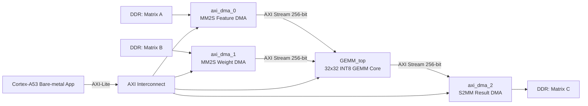

# GEMM 32x32 INT8 Accelerator on KV260

> A bare-metal FPGA/SoC project implementing a **32x32 INT8 GEMM accelerator** on the **Xilinx KV260 / K26** platform using **Vivado + Vitis 2022.2**, AXI DMA, AXI-Lite control, and AXI-Stream data movement.

---

## 1. Project Status

This project has been successfully tested on hardware.

```text
DMA0 feature done, status=0x00001002
DMA1 weight done, status=0x00001002
DMA2 result done, status=0x00001002
COMPARE PASS
```

Current verified configuration:

| Item | Value |
|---|---:|
| Matrix size | 32 x 32 |
| Data type | INT8 |
| Input A size | 1024 bytes |
| Input B size | 1024 bytes |
| Output C size | 1024 bytes |
| AXI Stream width | 256 bits |
| AXI Stream beat size | 32 bytes |
| Board | KV260 / K26 |
| Tool version | Vivado / Vitis 2022.2 |

---

## 2. Project Overview

The accelerator computes:

```text
C = A x B
```

Where:

```text
A: 32 x 32 INT8
B: 32 x 32 INT8
C: 32 x 32 INT8
```

The FPGA design receives input matrices through AXI DMA, performs GEMM in the custom RTL core, and writes the result back to DDR through another AXI DMA.

The CPU configures the accelerator through AXI-Lite registers.

---

## 3. High-Level Architecture



---

## 4. Hardware Data Path

| Block | Direction | Function |
|---|---|---|
| `axi_dma_0` | DDR -> GEMM | Sends feature matrix A to `feature_axis` |
| `axi_dma_1` | DDR -> GEMM | Sends weight matrix B to `weight_axis` |
| `axi_dma_2` | GEMM -> DDR | Receives output matrix C from `result_axis` |
| `GEMM_top` | Custom IP | Contains AXI-Lite control, AXI-Stream interfaces, and GEMM compute core |

DMA mapping:

```text
DMA0 MM2S  -> GEMM_top.feature_axis
DMA1 MM2S  -> GEMM_top.weight_axis
GEMM_top.result_axis -> DMA2 S2MM
```

---

## 5. Address Map

| IP Block | Purpose | Base Address | Vitis Macro |
|---|---|---:|---|
| `axi_dma_0` | Feature input DMA | `0xA0000000` | `XPAR_AXI_DMA_0_BASEADDR` |
| `axi_dma_1` | Weight input DMA | `0xA0010000` | `XPAR_AXI_DMA_1_BASEADDR` |
| `axi_dma_2` | Result output DMA | `0xA0020000` | `XPAR_AXI_DMA_2_BASEADDR` |
| `GEMM_top_0` | GEMM control | `0xA0030000` | `XPAR_GEMM_TOP_0_BASEADDR` |

Recommended `Defines.h` aliases:

```c
#define MM_ADDR             XPAR_GEMM_TOP_0_BASEADDR

#define FEATURE_DMA_ADDR    XPAR_AXI_DMA_0_BASEADDR
#define WEIGHT_DMA_ADDR     XPAR_AXI_DMA_1_BASEADDR
#define RESULT_DMA_ADDR     XPAR_AXI_DMA_2_BASEADDR

#define A_SIZE 32
```

More details are documented in:

```text
vivado/notes/address_map.md
```

---

## 6. GEMM Control Registers

The custom GEMM IP is configured through AXI-Lite.

| Register | Offset | Meaning | Current Test Value |
|---|---:|---|---:|
| `SHIFT` | `0x00` | Right shift after accumulation | `0` |
| `F_length` | `0x04` | Number of feature rows | `32` |
| `F_width_block_num` | `0x08` | Number of feature width blocks | `1` |
| `W_width_block_num` | `0x0C` | Number of weight/output width blocks | `1` |

For the verified 32x32 test:

```text
F_length          = 32
F_width_block_num = 1
W_width_block_num = 1
SHIFT             = 0
```

---

## 7. Repository Structure

Recommended repo layout:

```text
GEMM_32x32_KV260/
│
├── README.md
├── .gitignore
│
├── docs/
│   └── GEMM_32x32_DEBUG_README.md
│
├── rtl/
│   ├── GEMM_top.v
│   ├── GEMM_core.v
│   ├── In_buffer.v
│   ├── Buffer_feeder.v
│   ├── Out_buffer.v
│   ├── Gemm_compute_core.v
│   ├── PE_array.v
│   ├── PE_row.v
│   ├── PE.v
│   ├── Signed_adder.v
│   └── Right_shifter.v
│
├── axi_ip/
│   ├── Feature_stream_slave.v
│   ├── Feature_stream_slave_feature_axis.v
│   ├── Weight_stream_slave.v
│   ├── Weight_stream_slave_weight_axis.v
│   ├── Result_stream_master.v
│   ├── Result_stream_master_result_axis.v
│   ├── Control_register_file.v
│   └── Control_register_file_S0_AXI4Lite.v
│
├── tb/
│   └── GEMM_core_tb_renamed.sv
│
├── vivado/
│   ├── bd/
│   │   └── GEMM_BD.tcl
│   ├── scripts/
│   │   ├── create_project.tcl
│   │   ├── package_ip.tcl
│   │   └── export_xsa.tcl
│   └── notes/
│       └── address_map.md
│
└── vitis/
    └── gemm_test_app/
        └── src/
            ├── main.cpp
            ├── Defines.h
            ├── Matrix.cpp
            └── Matrix.h
```

---

## 8. Important Files

| File | Purpose |
|---|---|
| `vivado/bd/GEMM_BD.tcl` | Recreates the Vivado Block Design |
| `vivado/scripts/create_project.tcl` | Creates a clean Vivado project shell |
| `vivado/scripts/package_ip.tcl` | Packages `GEMM_top` as a custom IP |
| `vivado/scripts/export_xsa.tcl` | Builds/export hardware platform `.xsa` |
| `vivado/notes/address_map.md` | Documents address map, DMA register usage, and debug notes |
| `docs/GEMM_32x32_DEBUG_README.md` | Detailed debug history and known issues |
| `vitis/gemm_test_app/src/main.cpp` | Bare-metal test application |
| `vitis/gemm_test_app/src/Defines.h` | Hardware base address and register macros |

---

## 9. Vivado Rebuild Flow

### 9.1 Create Project

Open Vivado Tcl Console and run:

```tcl
cd <repo_root>/vivado/scripts
source create_project.tcl
```

### 9.2 Package Custom IP

```tcl
source package_ip.tcl
```

### 9.3 Recreate Block Design

```tcl
source <repo_root>/vivado/bd/GEMM_BD.tcl
```

### 9.4 Validate Block Design

```tcl
validate_bd_design
save_bd_design
```

### 9.5 Generate Bitstream and Export XSA

```tcl
source <repo_root>/vivado/scripts/export_xsa.tcl
```

Expected output:

```text
GEMM_BD_wrapper.xsa
GEMM_BD_wrapper.bit
```

---

## 10. Vitis Run Flow

The project was tested using a bare-metal application on:

```text
psu_cortexa53_0
standalone_domain
psu_uart_1
```

### 10.1 Create / Update Platform

In Vitis:

```text
New Platform Project
Select exported GEMM_BD_wrapper.xsa
Build Platform
```

### 10.2 Build App

Use the app source under:

```text
vitis/gemm_test_app/src/
```

Build the application to generate:

```text
gemm_test_app.elf
```

---

## 11. XSCT Manual Run Flow

Due to a Vitis GUI Run Configuration issue, the verified run used XSCT.

Example:

```tcl
connect
targets

targets -set -filter {name =~ "*PSU*"}
source {E:/VITIS_2022/gemm_top_caoky/export/gemm_top_caoky/hw/psu_init.tcl}
psu_init
psu_ps_pl_isolation_removal
psu_ps_pl_reset_config

fpga -f {E:/Everything_with_VIVADO/MM_final/MM_final.runs/impl_1/GEMM_BD_wrapper.bit}

targets -set -filter {name =~ "Cortex-A53 #0"}
rst -processor
dow {E:/VITIS_2022/gemm_test_app/Debug/gemm_test_app.elf}
con
```

Expected UART output:

```text
===== GEMM 32x32 DMA TEST START =====
DMA0 feature done, status=0x00001002
DMA1 weight done, status=0x00001002
DMA2 result done, status=0x00001002
COMPARE PASS
===== GEMM 32x32 DMA TEST END =====
```

---

## 12. DMA Execution Order

The safe DMA order is:

```text
1. Write GEMM control registers.
2. Flush cache for A, B, and C buffers.
3. Start DMA2 S2MM first.
4. Start DMA0 MM2S for matrix A.
5. Start DMA1 MM2S for matrix B.
6. Wait for DMA0, DMA1, and DMA2 done.
7. Invalidate result buffer cache.
8. Compare C_hw with C_sw.
```

Reason:

```text
The result DMA must be ready before GEMM starts producing output.
```

---

## 13. Known Issues and Fixes

### 13.1 Vitis GUI Error

Observed error:

```text
can't read "map": no such variable
```

This was caused by a broken Vitis Run Configuration / workspace metadata.

Workaround:

```text
Use XSCT manual run flow instead of GUI Launch Hardware.
```

---

### 13.2 AXI-Lite Read/Write Hang

Observed symptom:

```text
AXI-Lite bus test
DMA0 base = 0xA0000000
Read DMA0 DMASR...
```

The program hung while reading DMA status.

Root cause:

```text
PL reset was not released correctly because proc_sys_reset/dcm_locked was not driven high.
```

Fix:

```text
Connect xlconstant = 1'b1 to rst_ps8_0_99M/dcm_locked.
```

After the fix, AXI-Lite worked:

```text
DMA0 DMASR = 0x00000001
Write GEMM SHIFT done
```

---

### 13.3 DMA Done but Hardware Output All Zero

Observed symptom:

```text
DMA0 feature done
DMA1 weight done
DMA2 result done
C_hw all zero
COMPARE FAIL
```

Workaround:

```c
volatile u32 delay;

Xil_Out32(SHIFT_ADDR, 1);
Xil_Out32(FL_ADDR, 31);
Xil_Out32(FWBN_ADDR, 2);
Xil_Out32(WWBN_ADDR, 2);

for (delay = 0; delay < 100000; delay++);

Xil_Out32(SHIFT_ADDR, 0);
Xil_Out32(FL_ADDR, 32);
Xil_Out32(FWBN_ADDR, 1);
Xil_Out32(WWBN_ADDR, 1);

for (delay = 0; delay < 100000; delay++);
```

After this workaround:

```text
COMPARE PASS
```

Suspected RTL reason:

```text
Some GEMM internal config registers may only latch when the input value changes.
```

Long-term RTL recommendation:

```verilog
always @(posedge clk or negedge rst_n) begin
    if (~rst_n) begin
        shift             <= 0;
        F_length          <= 0;
        F_width_block_num <= 0;
        W_width_block_num <= 0;
    end else begin
        shift             <= shift_in;
        F_length          <= F_length_in;
        F_width_block_num <= F_width_block_num_in;
        W_width_block_num <= W_width_block_num_in;
    end
end
```

---

## 14. Hardware Test Result

Sample output from the verified run:

```text
C_hw sample 8x8:
  34   31  -32    0  -33   34   31  -32 
   2  -29   30   29  -32    2  -29   30 
  30  -29    2  -32   29   30  -29    2 
 -32   31   34  -33    0  -32   31   34 
 -34   -4  -34   36   36  -34   -4  -34 
  34   31  -32    0  -33   34   31  -32 
   2  -29   30   29  -32    2  -29   30 
  30  -29    2  -32   29   30  -29    2 

COMPARE PASS
```

---

## 15. Notes for Future Developers

Before modifying the RTL, always keep a known-good version of:

```text
main.cpp
Defines.h
GEMM_BD.tcl
GEMM_BD_wrapper.bit
GEMM_BD_wrapper.xsa
```

Recommended debug order:

```text
1. UART Hello World
2. AXI-Lite read DMA0 status
3. AXI-Lite write GEMM register
4. DMA0 MM2S only
5. DMA1 MM2S only
6. DMA2 S2MM only
7. Full GEMM
8. Software vs hardware comparison
```

Do not debug full GEMM before AXI-Lite and DMA are proven working.

---

## 16. What Should Not Be Pushed to GitHub

Do not push generated Vivado/Vitis folders:

```text
.runs/
.sim/
.cache/
.hw/
.ip_user_files/
.gen/
.Xil/
Debug/
Release/
.metadata/
```

Do not push heavy build artifacts directly unless needed:

```text
*.bit
*.xsa
*.hwh
*.elf
```

Recommended:

```text
Source code in repo
Bitstream/XSA/ELF in GitHub Release
```

---

## 17. Current Limitation

This is currently a fixed 32x32 INT8 GEMM hardware test. It is not yet a fully dynamic matrix multiplication engine for arbitrary matrix sizes.

Future work:

```text
- Clean RTL config register latch logic
- Add more hardware test cases
- Add identity matrix test
- Add performance measurement
- Add resource utilization table
- Add timing report summary
- Integrate into a larger Transformer / attention pipeline
```

---

## 18. Credits

This project was developed as part of an FPGA-based GEMM / AI accelerator workflow using Verilog, Vivado Block Design, AXI DMA, AXI-Lite control, and bare-metal Vitis testing on KV260.
