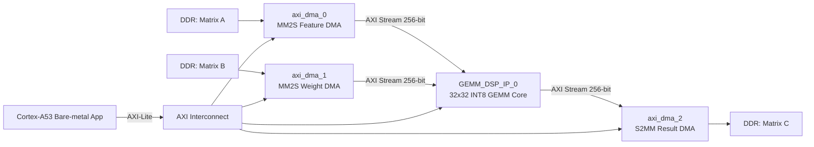

# GEMM 32x32 INT8 Accelerator on KV260

> A bare-metal FPGA/SoC project implementing a **32x32 INT8 GEMM accelerator** on the **Xilinx KV260 / K26** platform using **Vivado + Vitis 2022.2**, AXI DMA, AXI-Lite control, and AXI-Stream data movement.

---

## 1. Project Status

This project has been successfully tested on real KV260 hardware.

Verified UART result:

```text
DMA0 feature done, status=0x00001002
DMA1 weight done, status=0x00001002
DMA2 result done, status=0x00001002
GEMM done, status=0x06000000
COMPARE PASS
```

Current verified configuration:

| Item | Value |
|---|---:|
| Matrix size | 32 x 32 |
| Data type | signed INT8 |
| Input A size | 1024 bytes |
| Input B size | 1024 bytes |
| Output C size | 1024 bytes |
| AXI Stream width | 256 bits |
| AXI Stream beat size | 32 bytes |
| Board | KV260 / K26 |
| Tool version | Vivado / Vitis 2022.2 |
| Processor | Cortex-A53 #0, bare-metal |

Current local project paths:

```text
Vivado project : E:/Everything_with_VIVADO/GEMM_final_DSP
Vitis workspace: E:/VITIS_2022
Platform       : GEMM_final_DSP
Application    : GEMM_DSP
Bitstream      : E:/Everything_with_VIVADO/GEMM_final_DSP/GEMM_final_DSP.runs/impl_1/GEMM_DSP_BD_wrapper.bit
ELF            : E:/VITIS_2022/GEMM_DSP/Debug/GEMM_DSP.elf
PS init Tcl    : E:/VITIS_2022/GEMM_final_DSP/hw/psu_init.tcl
```

---

## 2. Project Overview

The accelerator computes:

```text
C = A x B
```

where:

```text
A: 32 x 32 INT8
B: 32 x 32 INT8
C: 32 x 32 INT8
```

The FPGA design receives input matrices from DDR through AXI DMA, performs GEMM in the custom RTL core, and writes the result back to DDR through another AXI DMA.

The Cortex-A53 bare-metal application configures the accelerator and the AXI DMA engines through AXI-Lite registers.

---

## 3. High-Level Architecture



---

## 4. Hardware Data Path

| Block | Direction | Function |
|---|---|---|
| `axi_dma_0` | DDR -> GEMM | Sends feature matrix A to `feature_axis` |
| `axi_dma_1` | DDR -> GEMM | Sends weight matrix B to `weight_axis` |
| `axi_dma_2` | GEMM -> DDR | Receives output matrix C from `result_axis` |
| `GEMM_DSP_IP_0` | Custom IP | Contains AXI-Lite control, AXI-Stream interfaces, and GEMM compute core |

DMA stream mapping:

```text
axi_dma_0/M_AXIS_MM2S  -> GEMM_DSP_IP_0/feature_axis
axi_dma_1/M_AXIS_MM2S  -> GEMM_DSP_IP_0/weight_axis
GEMM_DSP_IP_0/result_axis -> axi_dma_2/S_AXIS_S2MM
```

AXI-Lite mapping:

```text
GEMM_DSP_IP_0/S_AXI        -> AXI interconnect
axi_dma_0/S_AXI_LITE       -> AXI interconnect
axi_dma_1/S_AXI_LITE       -> AXI interconnect
axi_dma_2/S_AXI_LITE       -> AXI interconnect
```

---

## 5. Current Address Map

The current working address map is:

| IP Block | Purpose | Base Address | Vitis Macro |
|---|---|---:|---|
| `GEMM_DSP_IP_0` | GEMM control registers | `0xA0000000` | `XPAR_GEMM_DSP_IP_0_BASEADDR` |
| `axi_dma_0` | Feature input DMA, MM2S only | `0xA0010000` | `XPAR_AXI_DMA_0_BASEADDR` |
| `axi_dma_1` | Weight input DMA, MM2S only | `0xA0020000` | `XPAR_AXI_DMA_1_BASEADDR` |
| `axi_dma_2` | Result output DMA, S2MM only | `0xA0030000` | `XPAR_AXI_DMA_2_BASEADDR` |

Recommended `Defines.h` aliases:

```c
#define MM_ADDR             XPAR_GEMM_DSP_IP_0_BASEADDR

#define FEATURE_DMA_ADDR    XPAR_AXI_DMA_0_BASEADDR
#define WEIGHT_DMA_ADDR     XPAR_AXI_DMA_1_BASEADDR
#define RESULT_DMA_ADDR     XPAR_AXI_DMA_2_BASEADDR

#define A_SIZE              32U
```

Important:

```text
Do not use the old address map where DMA0 starts at 0xA0000000 and GEMM is at 0xA0030000.
The current project uses GEMM at 0xA0000000.
```

More details should be kept in:

```text
vivado/notes/address_map.md
```

or the current address-map document:

```text
ADDRESS_MAP_GEMM_32x32_KV260_CURRENT.md
```

---

## 6. GEMM Control Registers

The custom GEMM IP is configured through AXI-Lite.

Base:

```c
#define MM_ADDR 0xA0000000
```

Register map:

| Register | Offset | Meaning | Current Test Value |
|---|---:|---|---:|
| `SHIFT` / status | `0x00` | Right shift after accumulation; read status | `0` |
| `F_length` | `0x04` | Number of feature/output rows | `32` |
| `F_width_block_num` | `0x08` | Number of K blocks | `1` |
| `W_width_block_num` | `0x0C` | Number of output-width/N blocks | `1` |

For the verified 32x32 test:

```text
F_length          = 32
F_width_block_num = 1
W_width_block_num = 1
SHIFT             = 0
```

The `SHIFT` register also returns status bits when read:

```text
bit [9:0]   shift value
bit [16]    clear done request when writing
bit [24]    busy
bit [25]    done
bit [26]    idle
```

Example readback from a correct run:

```text
Readback SHIFT raw = 0x04000000, shift=0
Readback FL        = 0x00000020
Readback FWBN      = 0x00000001
Readback WWBN      = 0x00000001
```

---

## 7. Repository Structure

Recommended repo layout:

```text
GEMM_32x32_KV260/
│
├── README.md
├── .gitignore
│
├── docs/
│   ├── GEMM_32x32_DEBUG_README.md
│   ├── GEMM_32x32_KV260_DEBUG_NOTES_EN_CURRENT.md
│   └── QWEN_LINUX_SOFTWARE_GUIDE_KV260_EN.md
│
├── rtl/
│   ├── GEMM_top.v
│   ├── GEMM_core.v
│   ├── In_buffer.v
│   ├── Buffer_feeder.v
│   ├── Out_buffer.v
│   ├── Gemm_compute_core.v
│   ├── PE_array.v
│   ├── PE_row.v
│   ├── PE.v
│   ├── Signed_adder.v
│   └── Right_shifter.v
│
├── axi_ip/
│   ├── Feature_stream_slave.v
│   ├── Feature_stream_slave_feature_axis.v
│   ├── Weight_stream_slave.v
│   ├── Weight_stream_slave_weight_axis.v
│   ├── Result_stream_master.v
│   ├── Result_stream_master_result_axis.v
│   ├── Control_register_file.v
│   └── Control_register_file_S0_AXI4Lite.v
│
├── tb/
│   └── GEMM_core_tb_renamed.sv
│
├── vivado/
│   ├── bd/
│   │   └── GEMM_DSP_BD.tcl
│   ├── scripts/
│   │   ├── create_project.tcl
│   │   ├── package_ip.tcl
│   │   └── export_xsa.tcl
│   └── notes/
│       └── address_map.md
│
└── vitis/
    └── GEMM_DSP/
        └── src/
            ├── main.cpp
            └── Defines.h
```

The actual local Vivado/Vitis folders may differ, but the repo should keep source files, scripts, and notes in a clean structure.

---

## 8. Important Files

| File | Purpose |
|---|---|
| `vivado/bd/GEMM_DSP_BD.tcl` | Recreates the Vivado Block Design |
| `vivado/scripts/create_project.tcl` | Creates a clean Vivado project shell |
| `vivado/scripts/package_ip.tcl` | Packages the custom GEMM IP |
| `vivado/scripts/export_xsa.tcl` | Builds/exports hardware platform `.xsa` |
| `vivado/notes/address_map.md` | Documents address map and register usage |
| `docs/GEMM_32x32_KV260_DEBUG_NOTES_EN_CURRENT.md` | Current debug and run notes |
| `docs/QWEN_LINUX_SOFTWARE_GUIDE_KV260_EN.md` | Notes for future Linux/Qwen integration |
| `vitis/GEMM_DSP/src/main.cpp` | Bare-metal test application |
| `vitis/GEMM_DSP/src/Defines.h` | Hardware base address and register macros |

---

## 9. Vivado Rebuild Flow

### 9.1 Create or open project

Open Vivado Tcl Console and run:

```tcl
cd <repo_root>/vivado/scripts
source create_project.tcl
```

### 9.2 Package custom IP

```tcl
source package_ip.tcl
```

### 9.3 Recreate block design

```tcl
source <repo_root>/vivado/bd/GEMM_DSP_BD.tcl
```

### 9.4 Validate block design

```tcl
validate_bd_design
save_bd_design
```

### 9.5 Generate bitstream and export XSA

```tcl
source <repo_root>/vivado/scripts/export_xsa.tcl
```

Expected output:

```text
GEMM_DSP_BD_wrapper.bit
GEMM_DSP_BD_wrapper.xsa
```

After any RTL or BD change:

```text
1. Re-run synthesis.
2. Re-run implementation.
3. Generate a new bitstream.
4. Export a new XSA with bitstream included.
5. Rebuild the Vitis platform.
6. Rebuild the application.
```

---

## 10. Vitis Build Flow

The project was tested using a bare-metal application on:

```text
Cortex-A53 #0
standalone domain
serial UART at 115200 baud
```

### 10.1 Platform

Current platform project:

```text
E:/VITIS_2022/GEMM_final_DSP
```

The platform should be created from the exported XSA of the current Vivado project.

### 10.2 Application

Current application project:

```text
E:/VITIS_2022/GEMM_DSP
```

Build output:

```text
E:/VITIS_2022/GEMM_DSP/Debug/GEMM_DSP.elf
```

The application must use the current `xparameters.h` generated from the current platform.

---

## 11. Known-Good XSCT Run Flow

The Vitis GUI launch flow can be unreliable for this project. The verified run uses XSCT with explicit reset, bitstream programming, PS initialization, PS-PL isolation removal, A53 reset, ELF download, and run.

Save this script as:

```text
E:/VITIS_2022/run_gemm_dsp.tcl
```

or paste it directly into the XSCT Console.

```tcl
# ============================================================
# Known-good KV260 GEMM_DSP run script
# Vivado/Vitis 2022.2
# ============================================================

set BIT_FILE "E:/Everything_with_VIVADO/GEMM_final_DSP/GEMM_final_DSP.runs/impl_1/GEMM_DSP_BD_wrapper.bit"
set PSU_INIT "E:/VITIS_2022/GEMM_final_DSP/hw/psu_init.tcl"
set ELF_FILE "E:/VITIS_2022/GEMM_DSP/Debug/GEMM_DSP.elf"

catch {disconnect}
connect
targets

puts "===== RESET SYSTEM ====="
targets -set -filter {name =~ "PSU"}
rst -system
after 8000

puts "===== PROGRAM FPGA ====="
fpga -file $BIT_FILE
after 3000

puts "===== PSU INIT ====="
source $PSU_INIT
psu_init
after 2000

puts "===== REMOVE PS-PL ISOLATION ====="
catch {psu_ps_pl_isolation_removal}
catch {psu_ps_pl_reset_config}
catch {psu_post_config}
after 2000

puts "===== RESET A53 #0 ====="
targets -set -filter {name =~ "Cortex-A53 #0"}
rst -processor
after 1000

puts "===== DOWNLOAD ELF ====="
dow $ELF_FILE
after 1000

puts "===== RUN APP ====="
con
```

Run from XSCT:

```tcl
source E:/VITIS_2022/run_gemm_dsp.tcl
```

Expected UART output:

```text
===== GEMM 32x32 DMA TEST START =====
MM_ADDR          = 0xA0000000
FEATURE_DMA_ADDR = 0xA0010000
WEIGHT_DMA_ADDR  = 0xA0020000
RESULT_DMA_ADDR  = 0xA0030000
A_SIZE=32, MATRIX_A_BYTES=1024, MATRIX_B_BYTES=1024, MATRIX_C_BYTES=1024
Software GEMM start
Software GEMM done
stage 0: bus smoke test
READ DMA0 status...
DMA0 MM2S status = 0x00000001
READ DMA1 status...
DMA1 MM2S status = 0x00000001
READ DMA2 status...
DMA2 S2MM status = 0x00000001
READ GEMM status...
GEMM status = 0x04000000
...
DMA0 feature done, status=0x00001002
DMA1 weight done, status=0x00001002
DMA2 result done, status=0x00001002
GEMM done, status=0x06000000
Hardware GEMM done
COMPARE PASS
===== GEMM 32x32 DMA TEST END =====
```

Recommended procedure after powering on or after a stale run:

```text
1. Open the serial terminal at 115200 baud.
2. Power-cycle the KV260 for a few seconds.
3. Open XSCT Console.
4. Run the script above.
5. Wait for COMPARE PASS.
```

---

## 12. DMA Execution Order

The safe DMA order is:

```text
1. Write GEMM control registers.
2. Reset DMA channels if needed.
3. Flush cache for A, B, and C buffers.
4. Start DMA2 S2MM first.
5. Start DMA0 MM2S for matrix A.
6. Start DMA1 MM2S for matrix B.
7. Wait for DMA0, DMA1, and DMA2 done.
8. Wait/check GEMM done status.
9. Invalidate result buffer cache.
10. Compare C_hw with C_sw.
```

Reason:

```text
The result DMA must be ready before the GEMM core starts producing output.
```

---

## 13. Known Issues and Fixes

### 13.1 Vitis GUI launch can hang

Observed symptom:

```text
stage 0: bus smoke test
READ DMA0 status...
```

The program hangs before printing the DMA0 status value.

Meaning:

```text
The Cortex-A53 is trying to read 0xA0010004, but the DMA0 AXI-Lite slave is not responding.
```

Likely causes:

```text
- The FPGA bitstream was not programmed.
- The GUI used an old bitstream or old platform.
- PS-PL isolation was not removed.
- psu_post_config was not run.
- The ELF was launched before the PL was ready.
```

Stable solution:

```text
Use the known-good XSCT run script.
```

---

### 13.2 XSCT `mrd` can show a blocked PL address

Observed debugger message:

```text
Memory read error at 0xA0000000.
Blocked address 0xA0000000.
PL AXI slave ports access is not allowed.
This address has not been added to the memory map.
```

This can be an XSCT debugger memory-map issue, not a hardware failure.

Optional debugger fix:

```tcl
targets -set -filter {name =~ "Cortex-A53 #0"}
memmap -addr 0xA0000000 -size 0x00040000 -flags rw
mrd 0xA0000000
mrd 0xA0010004
mrd 0xA0020004
mrd 0xA0030034
```

The real validation is the A53 application successfully reading the registers and producing `COMPARE PASS`.

---

### 13.3 DMA done but output all zero

Older revisions had a suspected config-latch issue where the output could become all zero even after DMA completed.

Current project status:

```text
The current verified project does not use the old fake-config workaround.
The current software writes the real config once while the accelerator is idle.
The 32x32 test passes.
```

Current config write pattern:

```c
Xil_Out32(SHIFT_ADDR, R_SHIFT & 0x3FFU);
Xil_Out32(FL_ADDR, row_count);
Xil_Out32(FWBN_ADDR, k_block_count);
Xil_Out32(WWBN_ADDR, n_block_count);
```

Long-term RTL recommendation:

```text
The GEMM core should latch config deterministically on reset and/or at job start.
Avoid config logic that only updates internal registers when the input value changes.
```

---

## 14. Hardware Test Result

Sample output from the verified run:

```text
C_hw sample 8x8:
  34   31  -32    0  -33   34   31  -32 
   2  -29   30   29  -32    2  -29   30 
  30  -29    2  -32   29   30  -29    2 
 -32   31   34  -33    0  -32   31   34 
 -34   -4  -34   36   36  -34   -4  -34 
  34   31  -32    0  -33   34   31  -32 
   2  -29   30   29  -32    2  -29   30 
  30  -29    2  -32   29   30  -29    2 

COMPARE PASS
```

This confirms that the hardware result matched the software reference result for the current 32x32 test.

---

## 15. Notes for Future Developers

Before modifying the RTL, keep a known-good version of:

```text
main.cpp
Defines.h
GEMM_DSP_BD.tcl
GEMM_DSP_BD_wrapper.bit
GEMM_DSP_BD_wrapper.xsa
GEMM_DSP.elf
```

Recommended debug order:

```text
1. AXI-Lite smoke test.
2. GEMM control register write/readback.
3. DMA0 MM2S path.
4. DMA1 MM2S path.
5. DMA2 S2MM path.
6. Full GEMM 32x32 test.
7. Software vs hardware comparison.
8. Larger GEMM tests.
9. Qwen/Transformer integration.
```

Do not debug the full model before AXI-Lite, DMA, and the 32x32 GEMM test are proven working.

---

## 16. What Should Not Be Pushed to GitHub

Do not push generated Vivado/Vitis folders:

```text
.runs/
.sim/
.cache/
.hw/
.ip_user_files/
.gen/
.Xil/
Debug/
Release/
.metadata/
```

Do not push heavy build artifacts directly unless they are intentionally published as a release artifact:

```text
*.bit
*.xsa
*.hwh
*.elf
*.jou
*.log
*.wdb
```

Recommended:

```text
Source code, scripts, and documentation in the repository.
Bitstream, XSA, and ELF in GitHub Releases if needed.
```

---

## 17. Current Limitation

This is currently a verified **32x32 INT8 GEMM hardware test**.

It is not yet a fully dynamic matrix multiplication engine for arbitrary matrix sizes from software.

Future work:

```text
- Add 64x64 and multi-block tests.
- Add identity matrix test.
- Add performance measurement.
- Add resource utilization table.
- Add timing report summary.
- Clean up Linux/Qwen software flow.
- Integrate into a larger Transformer/Qwen inference pipeline.
```

---

## 18. Linux / Qwen Integration Reminder

When moving this accelerator to Linux for Qwen inference:

```text
- Do not directly reuse Xil_In32/Xil_Out32/Xil_DCacheFlushRange in Linux user-space.
- Load the bitstream before the Qwen app touches accelerator registers.
- Use UIO, /dev/mem, udmabuf, dma-proxy, CMA, or a custom driver depending on the software architecture.
- Do not pass normal malloc pointers directly to DMA.
- Use valid physical addresses for DMA.
- Handle cache coherency correctly.
- Always run AXI-Lite smoke test and GEMM 32x32 test before running Qwen.
```

Recommended bring-up order:

```text
1. AXI-Lite smoke test
2. GEMM 32x32 test
3. GEMM 64x64 test
4. One Qwen Linear layer
5. Q/K/V projection
6. MLP projection
7. One decoder layer
8. Full Qwen token generation
```

---

## 19. Credits

This project was developed as part of an FPGA-based GEMM / AI accelerator workflow using Verilog, Vivado Block Design, AXI DMA, AXI-Lite control, AXI-Stream data movement, and bare-metal Vitis testing on KV260.
