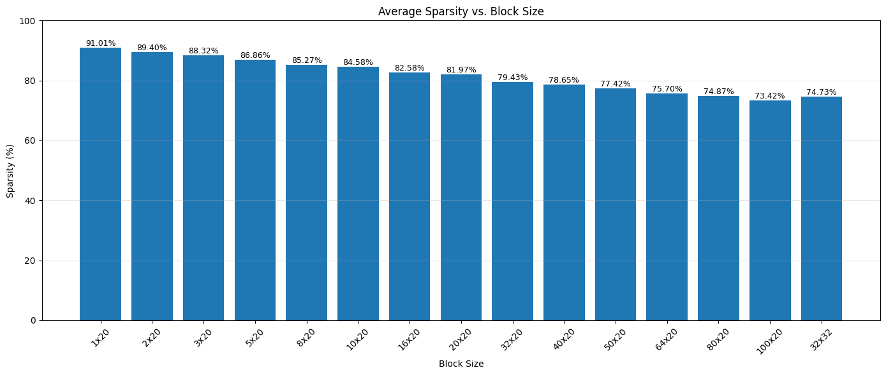
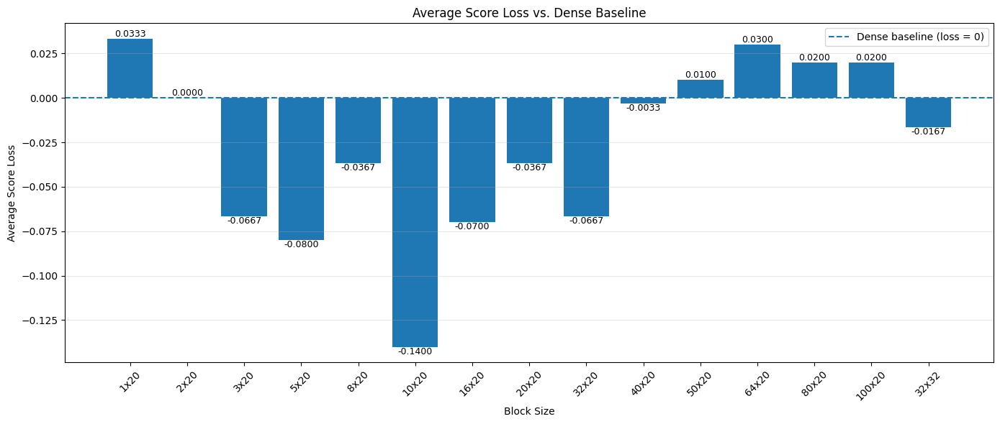
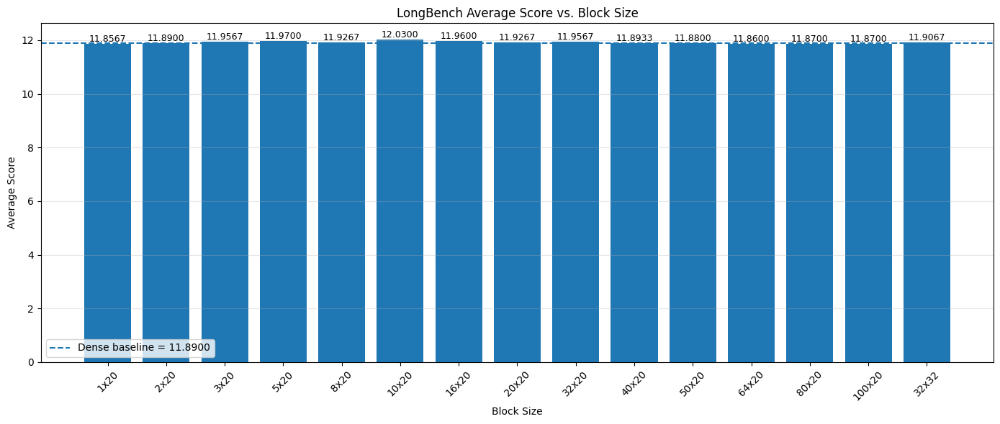
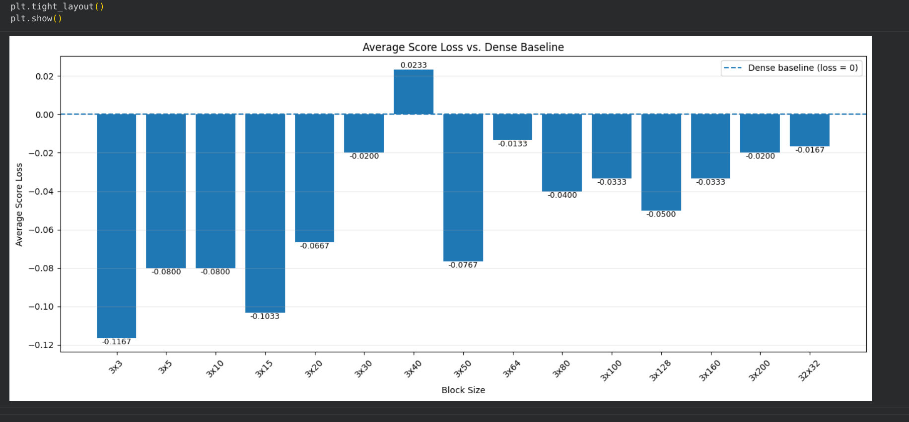
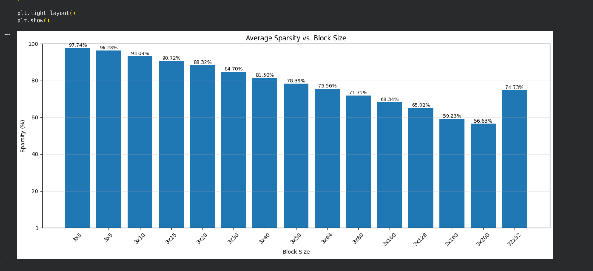
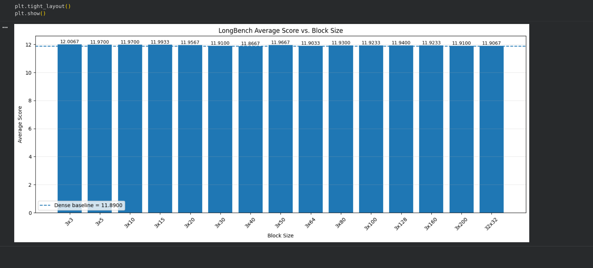
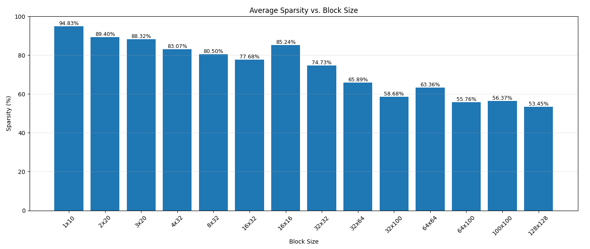
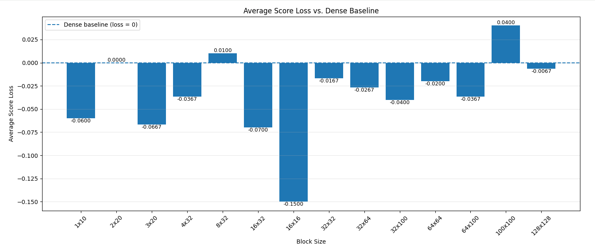
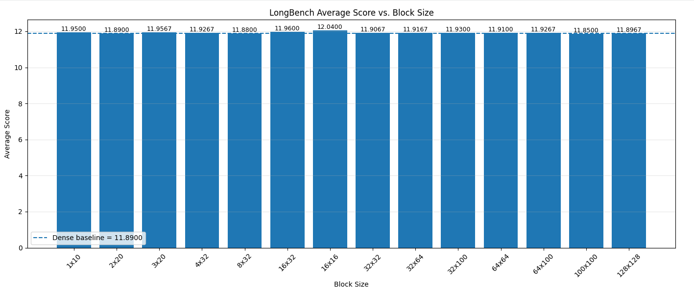

# Analysis of the Effect of Block Size on Sparsity and Accuracy

## 1. Experimental Setup

This experiment evaluates the effect of block size in the **block pruning** method. The model used in the experiment is **Llama-2**. The attention matrix is divided into non-overlapping blocks, and pruning is applied to each block.

## 2. Block Pruning Method

The attention matrix is divided into non-overlapping blocks. For each block, the attention values are summed row by row. A pruning threshold is then determined.

In this experiment:

- Pruning factor: **α = 20**
- The pruning threshold depends on the sequence length.
- A block is removed if all rows in the block have values below the pruning threshold.

The experiment is divided into three main studies:

- **Task A - Row Expansion:** increase the block size along the row dimension while keeping the column dimension fixed.
- **Task B - Column Expansion:** increase the block size along the column dimension while keeping the row dimension fixed.
- **Task C - Mixed Row and Column Expansion:** vary both dimensions simultaneously, with particular attention to hardware-friendly configurations such as **32×32**.

## 3. Evaluation Metrics

### 3.1. Sparsity

Sparsity represents the proportion of attention elements removed after pruning.

### 3.2. LongBench Score

Model quality after pruning is evaluated using three LongBench tasks:

- **NarrativeQA:** evaluates question answering over long narrative documents.
- **Qasper:** evaluates reading comprehension and question answering over scientific papers.
- **GovReport:** evaluates the ability to process and generate answers from long government reports.

### 3.3. Dense Score, Sparse Score, and Score Loss

- **Dense Avg Score:** average score of the original model without pruning.
- **Sparse Avg Score:** average score after block pruning.
- **Score Loss:** change in model quality relative to the dense baseline.

Interpretation of Score Loss:

- **Close to 0:** the sparse model preserves quality close to the dense model.
- **Positive:** the sparse model scores lower than the dense baseline.
- **Negative:** the sparse model scores higher than the dense baseline on the evaluated dataset.

---

# 4. Task A - Row Expansion

## 4.1. Results

| Block   | Sparsity (%) | Dense Avg Score | Sparse Avg Score | Avg Score Loss |
|:--------|-------------:|----------------:|-----------------:|---------------:|
| 1x20    | 91.014273 | 11.89 | 11.856667 | 0.033333 |
| 2x20    | 89.403646 | 11.89 | 11.890000 | 0.000000 |
| 3x20    | 88.318674 | 11.89 | 11.956667 | -0.066667 |
| 5x20    | 86.856361 | 11.89 | 11.970000 | -0.080000 |
| 8x20    | 85.266101 | 11.89 | 11.926667 | -0.036667 |
| 10x20   | 84.583689 | 11.89 | 12.030000 | -0.140000 |
| 16x20   | 82.581427 | 11.89 | 11.960000 | -0.070000 |
| 20x20   | 81.967743 | 11.89 | 11.926667 | -0.036667 |
| 32x20   | 79.429765 | 11.89 | 11.956667 | -0.066667 |
| 40x20   | 78.650097 | 11.89 | 11.893333 | -0.003333 |
| 50x20   | 77.417196 | 11.89 | 11.880000 | 0.010000 |
| 64x20   | 75.695681 | 11.89 | 11.860000 | 0.030000 |
| 80x20   | 74.865449 | 11.89 | 11.870000 | 0.020000 |
| 100x20  | 73.421903 | 11.89 | 11.870000 | 0.020000 |
| 32x32   | 74.731240 | 11.89 | 11.906667 | -0.016667 |

As the block size increases along the row dimension, sparsity decreases from approximately **91.01% for 1×20** to **73.42% for 100×20**. This indicates that larger row blocks are less likely to satisfy the pruning condition for the entire block.

At the same time, the LongBench score remains very close to the dense baseline of **11.89**. Therefore, within this experiment, increasing the block size along the row dimension has a stronger effect on sparsity than on model quality.

The **32×32** configuration achieves approximately **74.73% sparsity**, with **Sparse Avg Score = 11.9067** and **Score Loss ≈ -0.0167**.

---

# 5. Task B - Column Expansion

## 5.1. Results

| Block   | Sparsity (%) | Dense Avg Score | Sparse Avg Score | Avg Score Loss |
|:--------|-------------:|----------------:|-----------------:|---------------:|
| 3x3     | 97.740066 | 11.89 | 12.006667 | -0.116667 |
| 3x5     | 96.284140 | 11.89 | 11.970000 | -0.080000 |
| 3x10    | 93.088527 | 11.89 | 11.970000 | -0.080000 |
| 3x15    | 90.723784 | 11.89 | 11.993333 | -0.103333 |
| 3x20    | 88.318674 | 11.89 | 11.956667 | -0.066667 |
| 3x30    | 84.697812 | 11.89 | 11.910000 | -0.020000 |
| 3x40    | 81.496229 | 11.89 | 11.866667 | 0.023333 |
| 3x50    | 78.388524 | 11.89 | 11.966667 | -0.076667 |
| 3x64    | 75.556160 | 11.89 | 11.903333 | -0.013333 |
| 3x80    | 71.723694 | 11.89 | 11.930000 | -0.040000 |
| 3x100   | 68.343068 | 11.89 | 11.923333 | -0.033333 |
| 3x128   | 65.019047 | 11.89 | 11.940000 | -0.050000 |
| 3x160   | 59.232893 | 11.89 | 11.923333 | -0.033333 |
| 3x200   | 56.627875 | 11.89 | 11.910000 | -0.020000 |
| 32x32   | 74.731240 | 11.89 | 11.906667 | -0.016667 |

As the block size increases along the column dimension, sparsity decreases from approximately **97.74% for 3×3** to **56.63% for 3×200**. Wider blocks are less likely to be pruned because more elements must simultaneously satisfy the removal condition.

Although sparsity changes significantly, the sparse-model score remains close to the dense baseline of **11.89**. These results show that the column dimension strongly affects sparsity while having little impact on the LongBench score in this experiment.

---

# 6. Task C - Mixed Row and Column Expansion

## 6.1. Results

| Block   | Sparsity (%) | Dense Avg Score | Sparse Avg Score | Avg Score Loss |
|:--------|-------------:|----------------:|-----------------:|---------------:|
| 1x10    | 94.830000 | 11.89 | 11.950000 | -0.060000 |
| 2x20    | 89.400000 | 11.89 | 11.890000 | 0.000000 |
| 3x20    | 88.320000 | 11.89 | 11.956700 | -0.066700 |
| 4x32    | 83.070000 | 11.89 | 11.926700 | -0.036700 |
| 8x32    | 80.500000 | 11.89 | 11.880000 | 0.010000 |
| 16x32   | 77.680000 | 11.89 | 11.960000 | -0.070000 |
| 16x16   | 85.240000 | 11.89 | 12.040000 | -0.150000 |
| 32x32   | 74.730000 | 11.89 | 11.906700 | -0.016700 |
| 32x64   | 65.890000 | 11.89 | 11.916700 | -0.026700 |
| 32x100  | 58.680000 | 11.89 | 11.930000 | -0.040000 |
| 64x64   | 63.360000 | 11.89 | 11.910000 | -0.020000 |
| 64x100  | 55.760000 | 11.89 | 11.926700 | -0.036700 |
| 100x100 | 56.370000 | 11.89 | 11.850000 | 0.040000 |
| 128x128 | 53.447189 | 11.89 | 11.896667 | -0.006667 |

When both the row and column dimensions increase, sparsity decreases from approximately **94.83% for 1×10** to **53.45% for 128×128**. Larger blocks cover a wider attention region, reducing the probability that the entire block satisfies the pruning condition.

The sparse-model scores remain close to the dense baseline of **11.89**, with small Score Loss values in most configurations.

The **32×32** configuration achieves approximately **74.73% sparsity** with **Sparse Avg Score = 11.9067**. This configuration is particularly relevant because it balances pruning effectiveness with direct compatibility with a **32×32 accelerator architecture**.

---

# 7. Overall Observations

The three experiments show a consistent trend: **larger block sizes generally result in lower sparsity**. A larger block contains more attention elements, making it more difficult for the entire block to satisfy the pruning condition.

At the same time, the LongBench scores of the sparse configurations remain close to the dense baseline. Within the scope of this experiment, block size therefore has a stronger effect on **pruning sparsity** than on **model output quality**.

The **32×32** configuration is particularly relevant because it preserves model quality close to the dense baseline while directly matching the target **32×32 accelerator architecture**.
